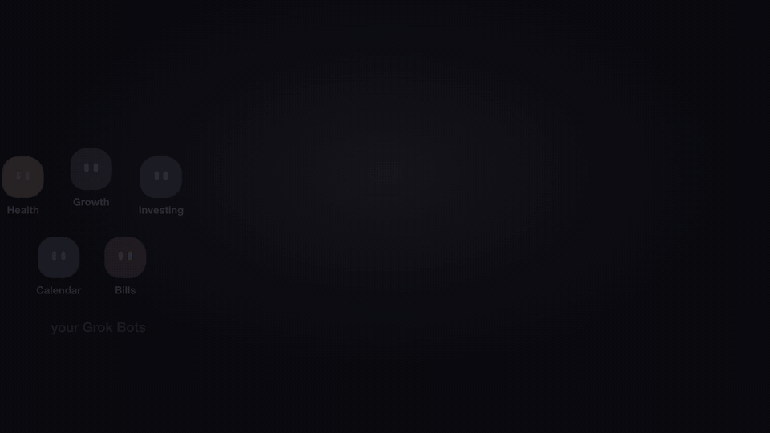
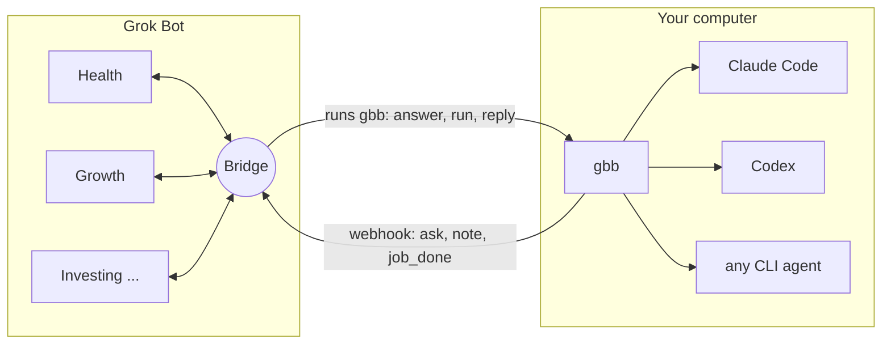
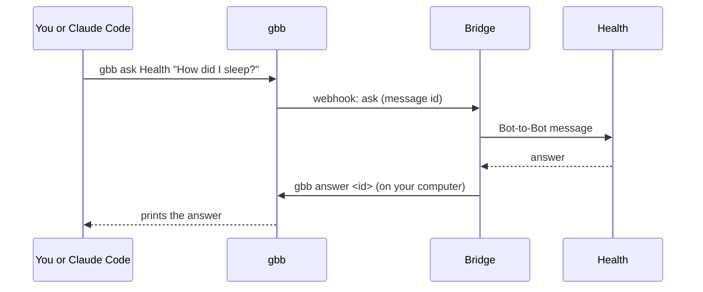

<div align="center">

# grok-bot-bridge

**Grok Bot, meet Claude Code.**

Your Grok Bots can run Claude Code, Codex or any CLI agent on your computer and get the result back.<br>
Your agents (and you) can ask any of your Bots a question from the terminal.<br>
One small CLI: `gbb`.

[](https://www.npmjs.com/package/grok-bot-bridge)
[](https://www.npmjs.com/package/grok-bot-bridge)
[](https://github.com/anup-a/grok-bot-bridge/actions/workflows/ci.yml)
[](LICENSE)
[](https://nodejs.org)
[](package.json)
<br>
[](https://docs.claude.com/en/docs/claude-code)
[](https://github.com/openai/codex)
[](skills/grok-bots/SKILL.md)

[Quick start](#quick-start) · [How it works](#how-it-works) · [Commands](#commands) · [Agent skill](#teach-your-agents) · [FAQ](#faq)



</div>

## What you can do

**Ask any of your Bots from the terminal.** The answer prints right there.

```console
$ gbb ask Health "How did I sleep last night?"
Asked Health via bridge (message mmulofiv416b5). Waiting up to 180s...
Solid night. Recovery looks good, so keep today's plan as is.
```

**Let your Bots run Claude Code.** Tell a Bot what you want in chat. It starts the job on your computer, moves on, and reports back when the job finishes.

```console
$ gbb run claude "count the .ts files in src/" --cwd ~/code/app
{"job_id": "jmulom5s97c63", "agent": "claude", "status": "queued", ...}
```

> **Bridge** (in Grok Bot): Claude job finished. 8 .ts files in src/: agents.ts, cli.ts, config.ts, ...

**Let Claude Code ask your Bots.** With the included skill, just say it:

```console
> ask my Growth bot what I should ship this week

⏺ Bash(gbb ask Growth "What should I ship this week?")
  ⎿ ...
```

## Quick start

**1. Install** (Node.js 20+)

```sh
npm install -g grok-bot-bridge
```

**2. Connect a Bridge Bot**

```sh
gbb setup
```

`gbb setup` prints a message and copies it to your clipboard. In the Grok Bot app, click **+**, then **Create new Bot**, and send it that message. The new Bot renames itself **Bridge**, creates a webhook routine, checks it can run `gbb` on your computer, and checks it can reach your other Bots. Then click the **Created routine** chip, copy the **Webhook URL** and **key** from the bottom of the panel, and paste them into `gbb setup`.

**3. Try it**

```sh
gbb ask <any Bot> "a question"
```

Setup also installs the `grok-bots` skill for Claude Code, so it can talk to your Bots too.

> [!NOTE]
> Bridge needs to use your computer (Grok Bot's **Execution on Local Computer** setting), because it delivers answers and starts jobs by running `gbb`.

## How it works

You connect **one** dedicated Bot, **Bridge**. Grok Bot already lets Bots message each other, so Bridge can reach every other Bot you have. Nothing needs setting up per Bot.



- **Out:** `gbb` sends events to Bridge's webhook routine: a plain HTTPS `POST` with a bearer key.
- **In:** Bridge reaches your computer through the Grok Bot app you already run, and runs `gbb` there. Your computer never needs to be reachable from the internet.

A question from your terminal, step by step:



A round trip usually takes 30 to 90 seconds. Most of that is the Bots thinking.

## Commands

| Command | What it does |
| --- | --- |
| `gbb setup [--bot NAME] [--hub]` | Connect a Bot's webhook routine. The first run connects a new Bridge Bot as the hub. |
| `gbb ask BOT "question" [--wait SEC]` | Ask any Bot and print the answer (waits up to 180s by default). |
| `gbb tell BOT "message"` | Send a Bot a message, no answer expected. |
| `gbb inbox [MESSAGE]` | Recent questions and answers. |
| `gbb run AGENT "task" [--cwd DIR] [--for BOT]` | Start a background agent job (`claude`, `codex`, or a custom agent). Prints a job id right away and reports the result to the Bot when done. |
| `gbb reply JOB "message"` | Continue that job's agent session, with full context. |
| `gbb status JOB` · `result JOB` · `wait JOB` · `cancel JOB` · `list` | Manage jobs. |
| `gbb notify "text"` · `gbb ping` | Send a note or a test event to the connected Bot. |
| `gbb install skill` | Install or update the Claude Code skill. |
| `gbb doctor` | Check credentials, agent CLIs and settings. |
| `gbb prompt [--bridge]` · `gbb instructions` | Print the setup message, or the usage guide for a Bot. |

Pass extra flags straight to the agent after `--`:

```sh
gbb run claude "Refactor utils" --cwd ~/code/app -- --permission-mode acceptEdits
gbb run codex "Update the README" -- --sandbox workspace-write
```

Headless agents use the permission settings you already have (`~/.claude/settings.json`, `~/.codex/config.toml`), so decide what a job may do without asking.

## Teach your agents

The [`grok-bots` skill](skills/grok-bots/SKILL.md) teaches an agent to use `gbb ask`, `tell` and `inbox`.

| Agent | How |
| --- | --- |
| Claude Code | Installed by `gbb setup`. Re-install with `gbb install skill`. |
| Codex, Cursor, Gemini CLI and [many more](https://skills.sh) | `npx skills add anup-a/grok-bot-bridge` |

Your Bots learn the `gbb` commands from the setup message, and Bots without computer access can ask Bridge to run them.

## Built to be safe and boring

- **No lost work.** Jobs run in the background, detached from the Bot's command timeout, and a job whose worker dies is marked failed instead of hanging forever.
- **No loops.** Bots are told never to start new jobs in reaction to results unless you asked. gbb also rate-limits sends (12 per Bot per hour by default), and `GBB_SILENT=1` turns sending off.
- **No surprises.** Bots are told never to post, email, DM, publish or spend from a routine without asking you. `allowedRoots` limits which folders jobs can run in.
- **Secrets stay secret.** Webhook keys live in the macOS Keychain (or a `0600` file elsewhere), are never logged, and are hidden while you paste them.
- **Tested.** Unit tests run on Linux and macOS in CI. A stress suite (`npm run stress`) covers 30 parallel jobs and questions, rate-limit races, 5 MB outputs, cancel, timeouts, killed workers and webhook failures.

> [!WARNING]
> Anyone with your webhook key can wake your Bot, and `gbb run` executes agents with your user's permissions. Treat the key like a password, and keep agent permission modes conservative.

<details>
<summary><b>Configuration</b></summary>

`~/.grok-bot-bridge/config.json` (`gbb config` prints it):

```json
{
  "defaultBot": "bridge",
  "hubBot": "bridge",
  "allowedRoots": ["~/code"],
  "maxPerHour": 12,
  "maxSummaryChars": 6000,
  "agents": {
    "claude": { "args": ["--permission-mode", "acceptEdits"] },
    "aider": { "command": ["aider", "--yes", "--message", "{prompt}"] }
  }
}
```

| Key | Meaning |
| --- | --- |
| `hubBot` | The connected Bot that relays `ask` and `tell` to other Bots. Set by `gbb setup --hub`. |
| `allowedRoots` | `gbb run` refuses working directories outside these roots. Unset means any directory. |
| `maxPerHour` | Webhook sends allowed per Bot per rolling hour. |
| `agents.<name>.args` | Extra args for built-in agents on every run. |
| `agents.<name>.command` | Adds a custom agent. `{prompt}` is replaced by the task, otherwise the task goes to stdin. Custom agents can't be resumed. |

Connect more Bots directly with `gbb setup --bot NAME`, then use `--bot NAME` on any command.

Environment: `GBB_HOME` (state directory), `GBB_SILENT=1` (send nothing), `GBB_NO_KEYCHAIN=1`, `GBB_WEBHOOK_URL` / `GBB_WEBHOOK_KEY`.

Jobs live in `~/.grok-bot-bridge/jobs/<id>/` (`job.json`, `stdout.log`, `stderr.log`, `result.txt`). The send log is `~/.grok-bot-bridge/notify.log`.

</details>

<details>
<summary><b>Webhook payload</b></summary>

Every request is a `POST` with `Authorization: Bearer <key>` and a JSON body:

```json
{
  "source": "grok-bot-bridge",
  "version": "0.2.0",
  "event": "job_done",
  "agent": "claude",
  "job_id": "jmujpg0qjfc1d",
  "session_id": "f10fc107-...",
  "cwd": "/Users/me/code/app",
  "summary": "Fixed the flaky test by ...",
  "reply_to": "Growth",
  "next": ["gbb reply jmujpg0qjfc1d \"<follow-up message>\"", "gbb result jmujpg0qjfc1d"],
  "text": "[grok-bot-bridge] job_done from claude (job jmujpg0qjfc1d) ...",
  "host": "my-mac",
  "ts": "2026-09-27T10:58:00.000Z"
}
```

Events: `ask` (with `to` and `message_id`), `note` (optionally with `to`), `job_done` and `job_failed` (with `reply_to` when started with `--for`), `ping`. `text` is a human-readable version of the same data, for routines that paste the body into a prompt.

</details>

<details>
<summary><b>Troubleshooting</b></summary>

- **Bridge can't run commands on your computer** ("temporarily unreachable", or `gbb version` fails): keep the Grok Bot desktop app open, check that **Execution on Local Computer** is on in its settings, and that your computer looks healthy under **Computers**. Right after a restart or an app update, give it a minute and ask Bridge to try again.
- **`gbb ask` exits with code 2 ("No answer yet")**: the other Bot is slow or busy. The answer still lands later: `gbb inbox <message_id>`.
- **"rate limit"**: raise `maxPerHour` in the config. Job results count too.
- **Nothing reaches the Bot**: run `gbb doctor`, then `gbb ping`, and check `~/.grok-bot-bridge/notify.log`.

</details>

## FAQ

**Why a dedicated Bridge Bot?** A routine belongs to one Bot, and creating one means chatting with that Bot and copying a URL and key. With a hub you do that once. A dedicated Bot also keeps relay traffic out of your other chats and gives the bridge its own permissions. Chief of Staff can play the same role if you prefer.

**Why a CLI and not an MCP server?** Grok Bot runs local (stdio) MCP servers on its own cloud machine, not on your computer, so an MCP server there can't start your local agents. Your Bot already reaches your computer through the Grok Bot app, and a CLI works through that today.

**Does my computer need to be reachable from the internet?** No. Traffic out is a plain HTTPS `POST` to the webhook. Traffic in comes through the Grok Bot app you already run.

**Can I use it without Grok Bot?** The sending side is just "POST JSON with a bearer token", so any webhook receiver works.

## Development

```sh
git clone https://github.com/anup-a/grok-bot-bridge && cd grok-bot-bridge
npm install
npm test        # build, then node:test against a local fake webhook and fake agents
npm run stress  # concurrency and failure modes
npm link        # use your checkout as the global gbb
```

Zero runtime dependencies. `dist/` is committed so installing straight from GitHub works without a build step, so run `npm run build` and commit `dist/` with source changes (CI checks it).

## License

[MIT](LICENSE). Unofficial community project, not affiliated with or endorsed by xAI, Anysphere, Anthropic or OpenAI.
